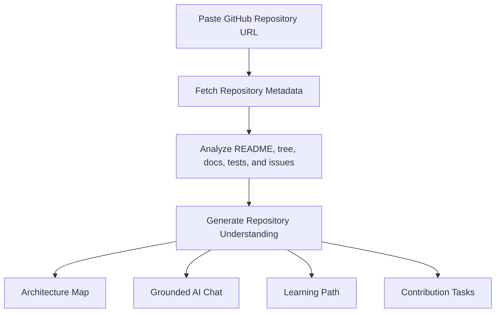

# RepoPilot

<div align="center">


<a href="https://git.io/typing-svg">
  
</a>

<br/>

<p>
  <b>AI workspace for understanding unfamiliar codebases</b>
</p>
<p>
  🧭 Architecture mapping • 🤖 Grounded repo chat • 🧩 Contributor onboarding • 🚀 Starter task discovery
</p>

<p>
  <a href="https://github.com/wangzh12023/RepoPilot">
    
  </a>
  <a href="https://github.com/wangzh12023/RepoPilot">
    
  </a>
  <a href="./LICENSE">
    
  </a>
</p>

<p>
  
  
  
  
  
</p>

</div>

---

<p align="center">
  <a href="#-demo">Demo</a> ·
  <a href="#-product-preview">Product Preview</a> ·
  <a href="#-why-repopilot">Why RepoPilot</a> ·
  <a href="#-features">Features</a> ·
  <a href="#-how-it-works">How It Works</a> ·
  <a href="#-quick-start">Quick Start</a> ·
  <a href="#-usage">Usage</a> ·
  <a href="#-environment-variables">Environment Variables</a> ·
  <a href="#-tech-stack">Tech Stack</a> ·
  <a href="#-roadmap">Roadmap</a> ·
  <a href="#-contributing">Contributing</a>
</p>

## 🎥 Demo

Paste a GitHub repository URL and RepoPilot turns it into an interactive architecture map, grounded chat workspace, learning path, and contribution guide.

<p align="center">
  <a href="https://github.com/wangzh12023/RepoPilot/raw/main/public/repopilot-demo.mp4">
    
  </a>
</p>

<p align="center">
  <a href="https://github.com/wangzh12023/RepoPilot/raw/main/public/repopilot-demo.mp4"><b>▶ Watch the demo video</b></a>
</p>

## 🖼️ Product Preview

<p align="center">
  
</p>

<table>
  <tr>
    <td width="50%">
      
    </td>
    <td width="50%">
      
    </td>
  </tr>
  <tr>
    <td width="50%">
      
    </td>
    <td width="50%">
      
    </td>
  </tr>
</table>

## ✨ Why RepoPilot

Open-source projects are powerful, but understanding a new repository is still slow.

Before making a contribution, developers often need to answer:

- What does this project actually do?
- Where is the core logic?
- How are the modules connected?
- Which files should I read first?
- What issues are suitable for beginners?
- How do I start contributing without getting lost?

RepoPilot shortens the path from **"I found a repo"** to **"I know where to start."**

## 🧠 Features

### 🗂️ Repository Overview

Get a high-level summary of the repository, including its purpose, main modules, stack hints, and structure.

### 🕸️ Architecture Map

Visualize how key folders, files, and modules connect so you can build a mental model faster.

### 🤖 Grounded AI Chat

Ask repository-specific questions and get answers grounded in README content, dependency manifests, docs, tests, and issue signals.

### 🪜 Learning Path

Follow an ordered onboarding path that moves from overview to core implementation and then to safe contribution slices.

### 🛠️ Contribution Tasks

Surface starter issues or synthesized contribution briefs with relevant files, difficulty level, and the safest first step.

### 🧑‍💻 Developer-Focused Workspace

Explore repository context through a dashboard built for architecture inspection, codebase navigation, and contributor onboarding.

## 🔄 How It Works



## 🚀 Quick Start

### 1. Clone the repository

```bash
git clone https://github.com/wangzh12023/RepoPilot.git
cd RepoPilot
```

### 2. Install dependencies

```bash
npm install
```

### 3. Configure environment variables

```bash
cp .env.example .env.local
```

The repository includes a committed `.env.example` with no sensitive values. Use it as the reference template for local setup.

Edit `.env.local`:

```bash
REPO_ANALYSIS_MODE=auto
DEEPSEEK_BASE_URL=https://api.deepseek.com
DEEPSEEK_MODEL=deepseek-v4-flash
DEEPSEEK_API_KEY=your_deepseek_api_key
# Strongly recommended for live analysis after anonymous GitHub rate limits are exhausted
GITHUB_TOKEN=your_github_token
```

### 4. Start the development server

```bash
npm run dev
```

Open `http://localhost:3000`.

## 🐳 Docker Deployment

### Option 1. One-command Docker Compose

```bash
cp .env.example .env.local
docker compose up --build
# or, if your Docker installation still uses the legacy plugin:
docker-compose up --build
```

Open `http://localhost:3000`.

### Option 2. Plain Docker

```bash
cp .env.example .env.local
docker build -t repopilot .
docker run --rm -p 3000:3000 --env-file .env.local repopilot
```

Open `http://localhost:3000`.

## 🧪 Usage

1. Start the app locally.
2. Paste a full GitHub repository URL into the landing page input.
3. Wait for RepoPilot to analyze the repository context.
4. Explore the overview, architecture map, learning path, and contribution tasks.
5. Use the chat panel to ask repository-specific questions grounded in the analyzed files and issue context.

## 🔐 Environment Variables

RepoPilot uses `.env.local` for local configuration. Start from `.env.example`, which is committed to this repository as a safe reference.

| Variable | Required | Description |
| --- | --- | --- |
| `REPO_ANALYSIS_MODE` | Yes | Controls how repository analysis runs. The default is `auto`. |
| `DEEPSEEK_BASE_URL` | Yes | Base URL for the DeepSeek API endpoint. |
| `DEEPSEEK_MODEL` | Yes | Model name used for repository analysis and chat. |
| `DEEPSEEK_API_KEY` | Yes | Your DeepSeek API key. |
| `GITHUB_TOKEN` | Recommended | Helps avoid anonymous GitHub API rate limits during live repository analysis. |

## 🧱 Tech Stack

- **Framework**: Next.js 16, React 19, TypeScript
- **UI**: Tailwind CSS, Radix UI, shadcn-style components
- **Agent UI**: assistant-ui
- **Graph Visualization**: XYFlow
- **State Management**: Zustand
- **LLM Provider**: DeepSeek API
- **Repository Data**: GitHub API

## 🧭 Try It With

- `https://github.com/vercel/next.js`
- `https://github.com/facebook/react`
- `https://github.com/langchain-ai/langchain`
- `https://github.com/shadcn-ui/ui`

## 🗺️ Roadmap

- [x] GitHub repository URL input
- [x] Repository structure analysis
- [x] AI-powered repository summary
- [x] Interactive dashboard workspace
- [x] Grounded assistant chat
- [x] Architecture visualization
- [x] Learning path generation
- [x] Contribution task suggestions
- [ ] File-level explanation with deeper code references
- [ ] Function-level dependency tracing
- [ ] Better issue recommendation ranking for first-time contributors
- [ ] Local repository indexing
- [ ] Private repository support
- [ ] Multi-model provider support
- [ ] VS Code extension
- [ ] Hosted demo

## 🤝 Contributing

Contributions are welcome.

Good first areas to improve:

- Repository analysis prompts and grounding quality
- Support for more LLM providers
- Architecture graph layout and readability
- Demo examples and onboarding docs
- UI and UX for code exploration
- Test coverage and error handling

Typical workflow:

1. Fork the repository.
2. Create a feature branch.
3. Make your changes.
4. Open a pull request.

```bash
git checkout -b feature/your-feature-name
```

## 📄 License

This project is licensed under the MIT License. See [LICENSE](./LICENSE).

## ⭐ Star RepoPilot

If RepoPilot helps you understand open-source repositories faster, consider giving the project a star.
